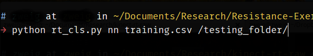
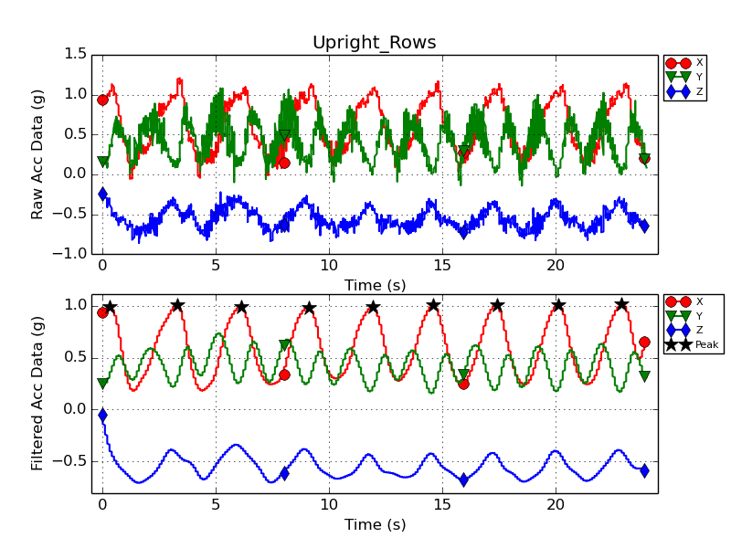

# Objective Assessment of Strength Training Exercises using a Wrist-Worn Accelerometer #
Classification of twelve different resistance exercises using nearest neighbor (cosine similarity) and support vector machine:

0. Bench press
1. Shoulder press
2. Bicep curl
3. Upright rows
4. Lateral raises
5. Overhead triceps extensions
6. Kneeling triceps kickbacks
7. Standing bent-over rows
8. Kneeling bent-over rows
9. Squats
10. Forward walking lunges
11. Calf raises

## Programming Language ##
[Python 2.7.x](https://www.python.org/)

## Packages ##
1. [Numpy](http://www.numpy.org/)
2. [Scipy](https://www.scipy.org/)
3. [Matplotlib](http://matplotlib.org/)
4. [Sklearn](http://scikit-learn.org/stable/)

## Data Sample ##
0,-0.886,-0.487,0.117,0

1st column: time sample

2nd column: X axis acc data

3rd column: Y axis acc data

4th column: Z axis acc data

5th column: label (0-11)

## How to Run ##
Type the following commands in the terminal

For nearest neighbor using cosine similarity:

  *python rt_cls.py nn training_set.csv /testing_set_folder/*

For support vector machine:

  *python rt_cls.py svm /folder_containing_all_datasets/*

## Sample Plots ##

## Contact ##
junguo AT boisestate DOT edu

## References ##
1. https://github.com/demotu/BMC

## Style ##
PEP8

## License ##
GPL v3 license

## FAQ ##
1. How to see the plots of the accelerometers data?

    Go to load_data function and change parameter plot to True

